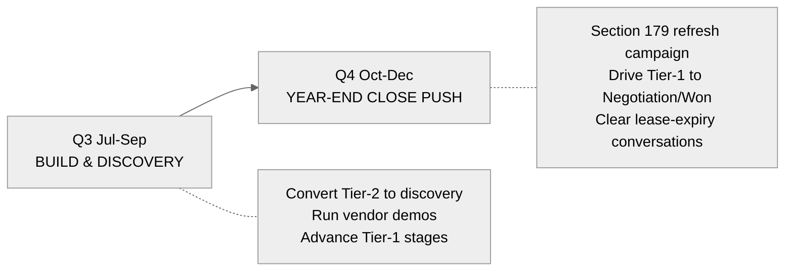
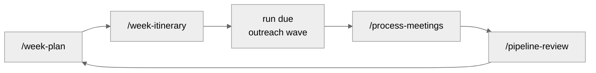

# H2 2026 Sales Plan — Maximize Year-End Closes

*Owner: Chris Barsanti · Mid Atlantic Machinery · Horizon: July–December 2026 · Created June 30, 2026*

> **No hard quota.** The objective is to maximize **qualified pipeline and closes** from the best-fit accounts. Goals below are **leading indicators**, not a revenue target.

---

## The Gap to Maximize

Chris owns 1,165 accounts with 203 open opportunities and a deep history of closed-won business. The half is not constrained by *more leads* — it's constrained by **focus and timing**:

1. **Open pipeline is broad but unranked.** 203 open opps compete for attention; without tiering, the high-probability and replacement-triggered deals get the same airtime as cold quotes.
2. **Replacement timing is invisible day-to-day.** EDA/UCC equipment data shows which customers own aging machines (plasma tables well past their 8–12 year window) and which leases are expiring — but only if it's surfaced on a schedule.
3. **Q4 has a structural tailwind that's easy to miss.** Section 179 expensing, year-end tax planning, and budget-flush buying make Oct–Dec the strongest close window of the year — *if* outreach is timed to it.

This plan closes those gaps with a **ranked target list**, a **seasonal campaign arc**, and **scheduled automation** that keeps the data fresh without manual runs.

See the live ranked list: [[Key_Accounts_H2-2026]] (`Planning/Key_Accounts_H2-2026.md`).

---

## Targeting Strategy — The Three Tiers

Accounts are scored 0–100 on a **balanced mix**: replacement urgency (35), historic buying (25), open pipeline (25), competitive displacement (15). See [[Key_Accounts_H2-2026]] for the full method and current standings.

| Tier | Definition | Cadence | Play |
|------|-----------|---------|------|
| **Tier 1** | Active (open) opportunity — especially advancing-stage or with a live replacement trigger | **Weekly** | Advance the deal; book demo/visit; in Q4, drive to PO with Section 179 leverage |
| **Tier 2** | Replacement-due or proven historic buyer, **no open opp today** | **Bi-weekly** | Open discovery off the lease/age trigger; convert to a real opp |
| **Tier 3** | Relationship / radar — mild or competitive-displacement signal | **Quarterly** | Event-driven touches, demo-day invites, displacement seeds |

Current standings (re-run `score-key-accounts.py` to refresh): **Tier 1 ~25 · Tier 2 ~8 · Tier 3 ~2** of 277 accounts showing signal.

**Top Tier-1 focus accounts going into Q3:** Chown's Fabrication & Rigging (aging PROMAX plasma + $967K open), R/J Florig (15-yr FICEP plasma + $480K open), Galaxy Manufacturing (5 prior wins + $617K open), and the large active deals at Hanwha Philly Shipyard, Kelly Iron Works, Human Active Technology, and SS Industries.

---

## The Seasonal Arc

### Q3 (Jul–Sep) — Build & Discovery
Fill the top of the funnel and advance what's open. Convert replacement-due Tier-2 accounts into real discovery conversations, anchor territory days on vendor demos/factory-rep visits, and move every Tier-1 deal at least one stage.

**Q3 goals (see `Planning/Quarter_Goals.md`):**
- **Pipeline & Revenue** — Advance ≥20 Tier-1 opps a stage; add ≥$1.5M weighted pipeline.
- **Account Management** — Convert ≥8 Tier-2 replacement-due accounts to active discovery.
- **Product & Market Knowledge** — Run ≥6 vendor demos / factory-rep visits.

### Q4 (Oct–Dec) — Year-End Close Push
Pivot the messaging to **Section 179 / tax-advantage / budget-flush** timing. This is the close half. Drive Tier-1 deals to decision, run a year-end demo-day campaign, and clear every CRITICAL/HIGH lease-expiry replacement conversation before Dec 31.

**Q4 goals:**
- **Pipeline & Revenue** — Drive ≥12 Tier-1 opps to Negotiation/Won using Section 179 leverage.
- **Account Management** — Documented replacement conversation + next step on every ≤180-day lease-expiry account.
- **Product & Market Knowledge** — Execute ≥2 year-end demo-day / Section 179 campaigns.

---

## Campaigns

Three campaigns map to the arc. Full briefs + cadences live in `Projects/Campaigns/Year-End_2026/`:

1. **[[Year-End_Equipment_Refresh_Section_179]]** — Q4, Tier 1+2. Tax-advantage close push for replacement-due accounts.
2. **[[Replacement-Timing_Outreach]]** — rolling Jul–Dec, Tier 2. EDA lease-expiry / age-triggered, machine-type segmented.
3. **[[Vendor_Demo_Day_Competitive_Displacement]]** — event-driven, Tier 1+3. Featured-vendor demos, factory-rep visits, displacement plays.

---

## The Weekly Operating Loop

This runs every week and is the engine that keeps the plan moving:

1. **`/week-plan`** — pull email, calendar, open pipeline, tasks into the week's priorities.
2. **`/week-itinerary`** — build the territory Excel; route Tier 1/2 accounts by territory, anchor on demos.
3. **Run the due outreach wave** — `/outreach-drafts-custom` generates `.scripts/outreach-[campaign]-[date].ps1`, pushing personalized **drafts to Outlook** for approval. **Never auto-sends.**
4. **`/process-meetings`** — capture meeting outcomes, update person/project pages, extract tasks.
5. **`/pipeline-review`** — log `[dex]`-tagged activity to Salesforce via `sf-activity-sync.py`.

**Monthly:** the customer-intel report (`Inbox/Reports/Customer_Intel_YYYY-MM.md`) and a re-run of `score-key-accounts.py` refresh the target list.

---

## Automation Backbone

Data refresh and reporting are scheduled on Windows (Task Scheduler) — see `.scripts/automation/`:

| Job | Schedule | What it does |
|-----|----------|--------------|
| Weekly SF sync | Mon 06:00 | Refresh local Salesforce cache (`sf-pull-sync.py`) |
| Weekly lease-expiry alert | Mon 06:30 | Short-lookback customer-intel report |
| Monthly intel report | 1st @ 08:00 | Full EDA report → `Inbox/Reports/` |

**Guardrail:** automation only **refreshes data and generates reports**. It never sends email or writes to Salesforce. All outreach stays draft-and-approve; all activity logging stays manual via `/pipeline-review`.

---

## Definition of Success

Not a dollar quota — a **system that runs**:

- The ranked target list is current and worked top-down every week.
- Every Tier-1 deal has a logged next step; every ≤180-day lease-expiry account has a replacement conversation.
- Q4 outreach is timed to Section 179 / year-end and the demo-day campaign ships.
- The weekly loop and monthly refresh run without manual prompting.
