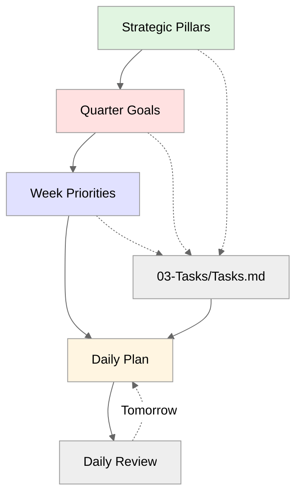

# Dex — Your AI Chief of Staff

**A starter kit for building your personal operating system with Claude.**

Clone this repo, run the setup wizard, tell it your role — and in 30 minutes you have a working system tailored to how you work. Strategic work management, meeting intelligence, relationship tracking, daily planning. All configured for whether you're a CMO, a sales leader, a PM, or any of 31 roles.

No coding required. Just [Cursor](https://cursor.com) and conversation.

Companion to [Episode 8 of The Vibe PM Podcast](https://link-tbd) and the [full blog post](https://link-tbd).

---

## Who This Is For

Non-engineers.

Product managers, marketers, sales leaders, designers, executives, HR leaders, consultants, coaches, analysts — anyone who wants the same leverage from AI that technical people have had access to.

**You don't need to know how to code.** Just follow the setup and talk to your AI assistant.

---

## Why This Exists

Most people use AI as a slightly smarter search engine. Dex is fundamentally different.

It's a personal operating system that handles the cognitive overhead of professional life. Think of it as hiring a Chief of Staff whose memory is your file system — who tracks commitments, relationships, and context so you can focus on conversations and decisions that actually matter.

---

## Quick Start

### Prerequisites

- [Cursor](https://cursor.com/) installed
- [Node.js 18+](https://nodejs.org/) installed

### Verify Your Setup

Before cloning, let's make sure everything's ready. Open your command line app:
- **Mac:** Press `Cmd+Space`, type "Terminal", press Enter
- **Windows:** Press `Win+R`, type "cmd", press Enter (this opens Command Prompt)

Paste these commands one at a time and press Enter:

```bash
# Check if git is installed
git --version

# Check if Node.js is installed
node --version
```

**What you should see:**
- Git: `git version 2.x.x` (any version is fine)
- Node: `v18.x.x` or higher (must be 18+)

**If either command says "command not found":**

1. **Install Git:**
   - **Mac:** Download installer from [git-scm.com](https://git-scm.com) and run it (click through all defaults)
   - **Windows:** Download installer from [git-scm.com](https://git-scm.com) and run it (click through all defaults)

2. **Install Node.js:**
   - **Both platforms:** Download from [nodejs.org](https://nodejs.org) (choose the "LTS" version)

After installing, close and reopen your command line app (Terminal on Mac, Command Prompt on Windows), then run the version checks again.

<details>
<summary><strong>Can't get git working? Download as ZIP instead</strong></summary>

If you're having trouble with git:

1. Go to [https://github.com/davekilleen/dex](https://github.com/davekilleen/dex)
2. Click the green **Code** button
3. Click **Download ZIP**
4. Unzip the file to your Documents folder
5. In Cursor: **File → Open Folder** → select the unzipped `dex-main` folder
6. Rename the folder to just `dex` when prompted

Then skip to Step 2 below.

</details>

### Step 1: Clone in Cursor

1. Open **Cursor**
2. Press `Cmd+Shift+P` (Mac) or `Ctrl+Shift+P` (Windows/Linux) to open the command palette
3. Type **"Git: Clone"** and select it
4. Paste this URL:
   ```
   https://github.com/davekilleen/dex.git
   ```
5. Choose where to save it (e.g., your Documents folder)
6. Click **Open** when Cursor asks if you want to open the cloned repository

### Step 2: Run the installer

Inside Cursor, open the built-in terminal:
- Go to **View → Terminal** (or press `` Ctrl+` ``)

Then run:

```bash
./install.sh
```

**What this does:**
- Installs the npm packages needed for MCP servers
- Configures the Work MCP server (enables task management with unique IDs and automatic sync)
- Configures the Career MCP server (powers `/career-coach` with data-driven insights)
- Configures the Resume MCP server (powers `/resume-builder`)
- Sets up Granola integration if you have it installed (optional meeting intelligence)

This takes about 1-2 minutes. Without it, the core features won't work — it's what transforms the repo from markdown files into a working system.

### Step 3: Run the setup wizard

1. In the Claude chat panel, type:
   ```
   /setup
   ```
2. Answer the questions about your role, company size, and priorities

The wizard generates your personalized system in about 2 minutes.

---

## What It Actually Does

Eight jobs that happen reliably every day:

| Job | What It Solves |
|-----|----------------|
| **Start Each Day Focused** | One command gives you three priorities. Heavy meeting day? Drops to two. Won't let you overcommit. |
| **Never Miss a Commitment** | Promises made in meetings extracted automatically. Three days old? Flagged. You can't forget. |
| **Track Relationships** | Before any call: what you discussed last time, open items, what they care about. Never walk in cold. |
| **Accelerate Career Growth** | Captures evidence automatically. Feedback from 1:1s, achievements, skills growth. Review-ready when you need it. |
| **Manage Tasks Reliably** | Unique IDs sync everywhere. Deduplication prevents doubles. Priority limits stop overcommit. Strategic alignment required. |
| **Reflect & Improve** | Captures mistakes → rules. Learns preferences. Each session makes the next better. |
| **Keep Projects Moving** | Auto-detects stalls (12+ days no update). Surfaces blockers. You know what needs attention. |
| **Evolve Itself** | Captures your improvement ideas. AI ranks by impact. `/dex-improve` plans implementation. System adapts to you. |

**Want deeper context?** See [Dex_Jobs_to_Be_Done.md](06-Resources/Dex_System/Dex_Jobs_to_Be_Done.md) for the full framework.

---

## What You Get

| Feature | Description |
|---------|-------------|
| **Eight core jobs** | Start focused, track relationships, never miss commitments, career evidence, task sync, learning, project health, system evolution |
| **Role-based scaffolding** | Tell it you're a CMO and get content pipelines. Sales VP gets deal tracking. 31 roles supported. |
| **Work management** | Complete planning hierarchy from quarterly goals to daily tasks. Unique IDs enable progress tracking and rollup across all levels. |
| **Meeting intelligence** | Process Granola transcripts into structured notes with action items auto-added to tasks |
| **Career development coach** | Your personal career coach that captures evidence, prepares reviews, assesses promotion readiness |
| **Person & company pages** | Relationship context for individuals + organization-level rollups (contacts, meetings, tasks) for Sales/CS |
| **Feature discovery** | Never miss capabilities. Run `/dex-level-up` anytime — suggests relevant features you haven't tried yet |
| **25+ core skills** | Daily planning, reviews, triage, meeting prep, career coaching, system improvement — invoke with `/skill-name` |
| **Role-specific skills** | Additional skills tailored to your role (PM, Sales, Marketing, etc.) discoverable through `/dex-level-up` |
| **Compound learning** | Captures your preferences and mistakes — every session improves the next |

---

## Conversational Capture

**The problem:** Ideas die between having them and recording them. Deciding where things belong kills momentum.

**Dex solves this.**

Just tell Claude things naturally:

```
You: "Sarah seemed worried about timeline but interested in Q2 pilot"

Claude: "I see you have 'Sarah's team onboarding' and 'Q2 Planning' 
in your Week Priorities. Should I add this to Sarah's person page 
and the Q2 Planning project?"

You: "Yes"
```

That's it. No special commands. No files to organize.

**Strategic intelligence:**
- Loads your Week Priorities and Quarterly Goals
- Suggests routing based on what you're actually focused on
- "Mobile app pricing" → sees "Mobile App Launch" in priorities → HIGH confidence
- Person mentioned in priorities → routing gets confidence boost

One decision instead of many. Immediate filing.

---

## Career Development That Compounds

**The problem:** You do great work every day — ship features, close deals, lead projects — but when review time comes, you're scrambling to remember what you accomplished. Evidence of your growth is scattered across Slack, emails, and fuzzy memories.

**Dex solves this.**

Run `/career-setup` once to establish your baseline:
- Your job description and role expectations
- Your company's career ladder / promotion criteria  
- Your most recent performance review
- Your long-term growth goals

From that point forward, **Dex automatically captures career evidence as you work**:
- During daily reviews → Prompts for achievements worth capturing
- From manager 1:1s (via Granola) → Extracts feedback and development discussions
- When projects complete → Saves impact and skills demonstrated

### Your Personal Career Coach

Run `/career-coach` anytime for:

| Mode | What It Does |
|------|--------------|
| **Weekly Report** | Generate a professional update for your manager in 30 seconds |
| **Monthly Reflection** | Spot patterns across your work — what's working, where to focus |
| **Self-Review** | Build your annual review from accumulated evidence — no scrambling |
| **Promotion Assessment** | Gap analysis against your career ladder with specific development plan |

The coach adapts to your career level — early career gets learning focus, senior gets strategic challenges.

**Why this matters:** Career progression is often the difference between thriving and feeling stuck. Having persistent context on your growth means reviews become collaborative discussions, not defensive retrospectives. Promotion cases are backed by concrete examples, not vague claims.

The system lives on your laptop. Your data stays yours. The longer you use it, the more powerful it becomes.

---

## Task Sync That Actually Works

Here's a problem every personal knowledge system has: tasks end up in multiple places — meeting notes, project files, person pages — and when you check one off, the others don't update.

**Dex solves this with automatic task sync.**

When you process a meeting:
1. Action items get unique IDs (e.g., `^task-20260128-001`)
2. Tasks are created in both the meeting note AND `03-Tasks/Tasks.md` with the same ID
3. When you mark a task done anywhere, it updates everywhere automatically

**Just tell Dex what you finished.** Use natural language:
- "I finished following up with John on pricing"
- "Mark the proposal task as done"
- "Completed the API documentation"

What happens automatically:
1. Dex searches for tasks matching your description
2. Finds the unique task ID
3. Updates the checkbox everywhere that task appears (03-Tasks/Tasks.md, meeting notes, person pages, project pages)
4. Adds a completion timestamp: `✅ 2026-01-28 14:35`

No manual syncing. No hunting through files. No duplicate checkboxes getting out of sync.

---

## How the Planning System Works

Everything in Dex connects — from your strategic pillars down to what you're doing today.



**The hierarchy:**

- **Strategic Pillars** — Your main focus areas (e.g., "Revenue Growth", "Product Quality"). Thematic, based on how you carve up your role. Don't change often (6-12+ months).

- **Quarter Goals** (optional) — 3-5 time-bound outcomes over 3 months that advance pillars. Set with `/quarter-plan`.

- **Week Priorities** — Top 3 outcomes this week that advance quarterly goals. Set with `/week-plan`.

- **Daily Plan** — Today's work that supports weekly priorities. Generated with `/daily-plan`.

- **03-Tasks/Tasks.md** — Your backlog, tagged with `#pillar` and linked to goals.

**The philosophy:** Quarterly planning isn't just task organization — it's about working backwards from career impact. Ask yourself: *What would make me incredibly happy I accomplished three months from now?* Your quarterly goals become the north star that keeps daily work connected to career-defining outcomes.

---

## No FOMO: Built-In Feature Discovery

Most productivity systems have a feature discovery problem: you don't know what you don't know.

**Dex solves this with `/dex-level-up`** — your personal concierge for discovering unused capabilities.

The system silently tracks which features you've used (stored locally in `System/usage_log.md`). When you run `/dex-level-up`, it:

1. Analyzes your usage patterns — what you're already doing consistently
2. Identifies natural next steps — features that build on your current habits
3. Shows 2-3 specific suggestions — never overwhelming, always relevant
4. Adapts to your experience level — beginners get basics, power users get advanced features

As you grow, recommendations evolve: Week 1 gets daily review suggestions. Month 3 gets custom MCP integration ideas.

---

## Try Before You Commit (Demo Mode)

Want to explore Dex without adding your own data? Enable demo mode.

Run `/dex-demo on` to use pre-populated sample content:
- A week of meeting notes with a fictional PM at TechCorp
- Active projects with realistic status and blockers
- Person pages for internal team and external customers
- Tasks across all priority levels
- Weekly priorities and daily plans

Everything happens in `System/Demo/` — your real vault stays untouched. When you're ready, run `/dex-demo off` to switch back.

Perfect for:
- New users exploring features before adding real data
- Demoing to colleagues
- Testing new workflows without risk

---

## The System That Improves Itself

Here's what makes Dex different from other starter kits: **it learns from how you work.**

Run `/daily-review` at end of day → explicitly captures learnings to `System/Session_Learnings/`. Weekly synthesis (`/week-review`) turns learnings into improvements.

**Background automation:**
- Changelog monitoring checks every 6 hours for new Claude Code features
- Learning review prompts check daily at 5pm — when 5+ learnings pending, reminds you to review
- Alert files (`System/changelog-updates-pending.md`) surface during planning

The system stays current automatically. You just respond to the nudges.

**What gets captured:**
- **Mistake Patterns** — Logged mistakes become rules that prevent repetition
- **Working Preferences** — Your communication style, tool preferences, meeting habits
- **System Improvements** — Run `/dex-whats-new` to check for learnings and new capabilities

**Day 1:** Helpful but generic.  
**Week 2:** Knows your preferences, catches your common mistakes.  
**Month 1:** Genuine thought partner that adapts to your style.

This is the compound engineering unlock: instead of your system decaying over time like traditional software, every session makes the next one better.

---

## Supported Roles

31 role configurations. The scaffolding changes completely based on your answer.

<details>
<summary>View all roles</summary>

**Core Functions:** Product Manager, Sales, Marketing, Engineering, Design

**Customer-Facing:** Customer Success, Solutions Engineering

**Operations:** Product Operations, RevOps/BizOps, Data/Analytics

**Support Functions:** Finance, People (HR), Legal, IT Support

**Leadership:** Founder

**C-Suite:** CEO, CFO, COO, CMO, CRO, CTO, CPO, CIO, CISO, CHRO, CLO, CCO

**Independent:** Fractional CPO, Consultant, Coach

**Investment:** Venture Capital / Private Equity

</details>

---

## What It Costs

| Item | Cost |
|------|------|
| Cursor Pro | $20/month (Claude included) |
| Cursor Free | $0 (limited usage, enough to try it) |
| Time | 30 minutes to set up |
| Coding skills | None required |

---

## Documentation

**Quick to running?** Start above. **Want deep dive?**

- **[Dex_System_Guide.md](06-Resources/Dex_System/Dex_System_Guide.md)** — Complete feature reference, all 42+ skills, daily workflows, MCP tools
- **[Dex_Jobs_to_Be_Done.md](06-Resources/Dex_System/Dex_Jobs_to_Be_Done.md)** — Why each piece exists, how they connect, component index
- **[Dex_Technical_Guide.md](06-Resources/Dex_System/Dex_Technical_Guide.md)** — MCP servers, integrations, hooks, automation deep dive
- **[FOLDER_STRUCTURE.md](06-Resources/Dex_System/FOLDER_STRUCTURE.md)** — PARA organization explained in detail

These live in your vault after setup.

---

## Resources

- [Vibe PM Episode 8](https://link-tbd) — Video walkthrough
- [Companion Blog Post](https://link-tbd) — Deep dive on all the concepts
- [Cursor](https://cursor.com) — The AI-powered editor
- [Granola](https://granola.ai) — Meeting transcription (optional)

---

## Share the Vibes

Found this useful? Share with colleagues:

> I've been using an AI personal operating system for my work — handles task management, meeting prep, relationship tracking, and daily planning. Non-engineers can set it up in 30 minutes. Check out the Vibe PM Podcast Episode 8 and the GitHub repo: [link-tbd]

---

## Credits

Built with Claude. Created by [Dave Killeen](https://www.linkedin.com/in/davekilleen/), Field CPO for EMEA at Pendo and host of The Vibe PM Podcast.

Inspired by:
- [Aman Khan's personal-os](https://github.com/amankhan/personal-os)
- [Compound Engineering](https://github.com/EveryInc/compound-engineering-plugin) by Dan Shipper and Every

---

## License

MIT

---

Run `/setup` to get started.
