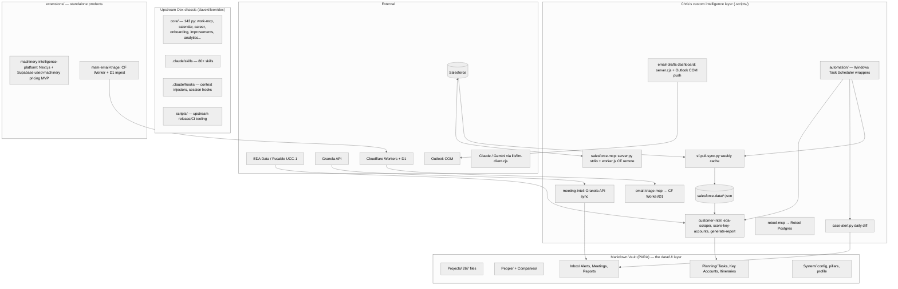

# Dex Customer Intelligence Platform — Architecture & Product Review

**Date:** July 6, 2026
**Scope:** Full repository review — architecture, engineering quality, security, product, UX, and roadmap — optimized for a TRUMPF/fab-equipment sales engineer covering Eastern PA.

---

## 1. Executive Summary

Dex has evolved from a generic "AI chief of staff" vault (the upstream `davekilleen/dex` project) into a genuinely differentiated **customer intelligence platform for capital equipment sales**. The custom layer Chris has built on top — Salesforce sync + local analysis cache, EDA/UCC equipment intelligence, key-account scoring, lease-expiry alerts, case alerts, email triage, outreach drafting, and the weekly field itinerary — is the real product. The upstream vault system is the chassis.

**What's working well:**
- The **"Salesforce = system of record, local cache = system of analysis"** pattern (`sf-pull-sync.py` → `.scripts/salesforce-data/*.json`) is the single best architectural decision in the repo. It makes every downstream analysis fast, offline-capable, and API-quota-free.
- The **key-account scorer** (`score-key-accounts.py`) encodes a real, explainable sales methodology (replacement urgency 35 / historic buying 25 / pipeline 25 / competitive displacement 15) — most commercial CRM "AI scoring" is less transparent than this.
- **Draft-and-approve discipline** is consistently enforced: no scheduled job sends email or writes to Salesforce. That guardrail is documented in `register-automation.ps1` and honored everywhere.
- Windows Task Scheduler automation is idempotent, least-privilege, and well-documented.

**What needs attention (top 5):**
1. **Salesforce auth/query code is duplicated across ~7 files** — one bug fix means seven edits.
2. **Three parallel Salesforce MCP servers** (`salesforce` local stdio, `salesforce-remote` Cloudflare Worker, `salesforce-sobject-all`) with overlapping tools and a hardcoded owner ID in the Worker.
3. **Secrets sprawl** — plaintext `.env`, creds embedded in `.mcp.json`, scripts that read `.mcp.json` as a credential fallback, session cookies cached in plaintext.
4. **The 2,446-line `salesforce-mcp/server.py` monolith** mixes OAuth, HTTP server, email queue, and ~35 tools in one file.
5. **Name-based fuzzy joins** between EDA data and Salesforce accounts contradict the skill's own "never fuzzy match" rule and will silently mis-attribute equipment.

None of these are urgent fires — the system works. But the duplication and secrets items should be addressed before the custom layer grows further.

---

## 2. Architecture Summary

### 2.1 Layer map

### 2.2 Folder purposes

| Folder | Purpose | Health |
|---|---|---|
| `Projects/`, `People/`, `Planning/`, `Inbox/`, `System/`, `Career/`, `Archive/` | Live PARA vault — the "database" and "UI" | Active |
| `core/` | Upstream Dex Python: all generic MCP servers (work, calendar, career, onboarding…) | Upstream-managed; don't fork |
| `.claude/skills/` | 80+ skills; custom ones suffixed `-custom` (update-safe) | Active |
| `.claude/hooks/` | Person/company context injection, session start/end, meeting cache | Active |
| `.scripts/` | **Chris's custom layer** — all Salesforce/EDA/email/itinerary automation | Active; was accumulating one-offs (now archived to `.scripts/archive/one-offs/`) |
| `scripts/` (no dot) | Upstream release/CI tooling (build-release, security-gate) | Upstream; easily confused with `.scripts/` |
| `extensions/` | Standalone products: used-machinery platform (Next.js/Supabase), email-triage Worker (CF/D1) | In development |
| `00-Inbox/`…`07-Archives/` | Legacy numbered PARA scaffolding — **empty/unused** | Dead; candidates for removal |
| `nimbalyst-local/`, `pi-extensions/`, `packages/` | Side experiments / contracts | Low activity |

### 2.3 Scheduled jobs (Windows Task Scheduler, via `register-automation.ps1`)

| Task | Schedule | What it does | Writes |
|---|---|---|---|
| Dex-Weekly-SF-Sync | Mon 06:00 | Refresh local SF cache (all objects) | `.scripts/salesforce-data/*.json` |
| Dex-Weekly-Lease-Alert | Mon 06:30 | Short-lookback lease-expiry report | `Inbox/Reports/` |
| Dex-Monthly-Intel-Report | 1st @ 08:00 | Full customer-intelligence report | `Inbox/Reports/` |
| Dex-Daily-Case-Alert | Daily 07:15 | Diff open Cases, toast + alert note | `Inbox/Alerts/` |

All read-only against Salesforce. Guardrail: no scheduled job sends email or writes to SF.

### 2.4 External APIs & credentials

| Service | Auth | Stored where |
|---|---|---|
| Salesforce REST (local MCP + scripts) | OAuth PKCE + refresh token | `~/.claude/sf_tokens.json`; client id/secret in `.mcp.json` env / `.env` |
| Salesforce (remote Worker MCP) | client-credentials; bearer `MCP_SECRET` for Dex→Worker | Cloudflare secrets; **OWNER_ID hardcoded in worker.js** |
| EDA Data / Fusable | Username/password via Playwright OIDC login | Plaintext in `.env`; cookies cached `~/.claude/eda_session.json` |
| Granola | API key | `.env` / env var |
| Retool Postgres (email/calendar) | `RETOOL_DB_URL` conn string | env |
| Cloudflare D1 (email triage) | Worker bearer | `.env` fallback walk-up loader |
| Outlook | Local COM automation (no creds) | n/a |
| Claude/Gemini | API keys via `lib/llm-client.cjs` | env |

---

## 3. Technical Debt Report (ranked by severity)

### SEV-1 — fix before the layer grows

1. **Duplicated Salesforce auth/query code (7 files).** `load_tokens`/`refresh_access_token`/`sf_query_all` and the `.mcp.json` credential-fallback dance are copy-pasted across `salesforce-mcp/server.py`, `sf-pull-sync.py`, `sf-activity-sync.py`, `case-alert.py`, `customer-intel/generate-report.py`, `eda-scraper.py`, and partially `email-drafts/server.cjs`. A token-handling bug or an API version bump (`v59.0` is also hardcoded per-file) requires seven synchronized edits.
   **Fix:** create `.scripts/lib/sflib.py` (auth, token refresh, `query_all`, credential resolution) and import it everywhere. ~Half-day, near-zero behavior risk since the logic is already identical.

2. **Three overlapping Salesforce MCP servers.** `salesforce` (local stdio, 35+ tools), `salesforce-remote` (Cloudflare Worker mirror with a *subset* of tools and separately-maintained SOQL), and `salesforce-sobject-all` (generic SOQL). Skills reference different ones (`customer-intel` → remote; quote workflow → local). Tool drift between server.py and worker.js is already visible.
   **Fix:** pick the local server as canonical; keep the Worker only for the tools genuinely needed when the laptop is off (or retire it); document which skills use which and why in `.claude/reference/mcp-servers.md`.

### SEV-2 — security & correctness

3. **Secrets sprawl.** `.env` at vault root holds EDA username/password in plaintext; `.mcp.json` embeds SF client secret; multiple scripts walk parent directories loading any `.env` they find; EDA session cookies persist 8h in `~/.claude/eda_session.json`. Nothing is git-tracked (verified — `.env`, `.mcp.json`, tokens all ignored), so exposure is local-only, but any tool with filesystem read (including MCP servers and this session) can read them.
   **Fix:** move secrets to Windows Credential Manager (PowerShell `Get-StoredCredential` / Python `keyring`), or minimally consolidate to ONE `.env` with a single loader in `sflib`. Also restrict the walk-up `.env` loader in `email-triage-mcp/server.py` — loading whatever `.env` a parent directory happens to contain is an injection vector.

4. **SOQL built with f-string interpolation.** Account names and search terms are interpolated directly into SOQL across server.py, worker.js, and sync scripts. Inputs come from Chris/Claude (not hostile users), so risk is data-corruption-by-apostrophe rather than attack — but "O'Brien Metals" will break queries today.
   **Fix:** one `soql_escape()` in `sflib` applied at every interpolation point.

5. **Fuzzy name joins contradict the matching contract.** `customer-intel/SKILL.md` says "Never use fuzzy or plain name-only matching," yet `score-key-accounts.py` joins the EDA market report to accounts by `norm_name()` alone. A wrong join here mis-scores an account and can send you to the wrong shop with the wrong lease date.
   **Fix:** prefer `UCC_BuyID__c` / `account_id` joins (already present in the owned-plasma CSV path); when only a name is available, require name **+ state/ZIP** to match, and log unmatched rows to a review file instead of silently dropping or guessing.

6. **Silent failure swallowing.** `get_valid_tokens()` returns stale tokens on refresh failure "and lets the caller fail"; several `except Exception: pass` blocks in config loaders; scheduled jobs write errors only to manifest fields. When the Monday sync silently fails, everything downstream (scorer, itinerary, reports) runs on stale data with no warning.
   **Fix:** the manifest already records per-object sync timestamps — have `score-key-accounts.py` and `/week-itinerary` **refuse or warn when the cache is older than 8 days**. Add a `.logs/automation.log` append in the PowerShell wrappers (they already have the plumbing).

### SEV-3 — maintainability

7. **`salesforce-mcp/server.py` is a 2,446-line monolith** (OAuth flow + HTTP callback server + email queue + ~35 tools). Split into `auth.py`, `tools/*.py`, `email_queue.py` once `sflib` exists.
8. **No tests for the custom layer.** Upstream `core/` and `mam-email-triage` have tests; `.scripts/` has none. The scorer is the highest-value target: its rubric is pure functions — snapshot-test `score_account()` with fixture accounts.
9. **Dead scaffolding:** empty `00-Inbox/`…`07-Archives/` numbered folders duplicate the live PARA folders; `.pytest_cache`, `.cursor`, `.pi` accumulate. One-off outreach/migration/test scripts were archived to `.scripts/archive/one-offs/` as part of this review.
10. **Naming inconsistency:** kebab-case `.py` files (`sf-pull-sync.py`) can't be imported as modules — a forcing function toward copy-paste (see item 1). New shared code should be snake_case importable modules; CLI wrappers can stay kebab.
11. **`scripts/` vs `.scripts/` confusion** — upstream release tooling vs. user automation. A README in each stating "this one is upstream / this one is yours" costs 5 minutes.

### Performance
No real bottlenecks at current scale (hundreds of accounts, thousands of cache records — JSON files load in milliseconds). The one latent issue: `eda-scraper.py` full downloads of 32 saved queries are serial; fine monthly, slow if run ad hoc. Not worth optimizing yet. If the cache grows past ~50MB or you want cross-object queries, move `salesforce-data/` from JSON to **DuckDB/SQLite** — one file, SQL joins, still local.

---

## 4. Product Improvement Report

You've already built (and should not rebuild): key-account scoring, lease-expiry alerting, case alerts, email triage, outreach drafting w/ review dashboard, weekly itinerary, meeting logging to SF, quote-from-email. The gaps that would most increase revenue-per-admin-hour:

### A. The Morning Brief (highest leverage, mostly assembly)
Today the daily signal is scattered: case alert note, lease report, calendar, unreplied emails, tasks. One scheduled job (or `/daily-plan` extension) should merge into a single `Inbox/Daily_Brief.md`: today's route + meetings, cases that changed, leases newly inside 180d, unreplied customer emails > 3 days, opps with `TouchNextDate__c` due, and the top-3 Tier-1 actions from the scorer. Everything already exists as a data source — this is a join, not a build.

### B. Visit-Prep Packet (`/visit-prep [account]`)
One command → a one-page account brief: equipment floor w/ ages vs. lifecycle clock, lease dates, open opps + quotes, last 5 activities, key contacts, open cases, talking points ("their 2014 CO2 laser is 4yr past window; lease frees $X/mo in October"). Printable/phone-readable. This is `customer-intel` + `meeting-prep` fused and pre-formatted for the truck. Batch mode: `/visit-prep --route tuesday` preps every account on that day's itinerary.

### C. Buying-signal detection
You have the raw feeds: email triage D1 (inbound language), EDA new-filing pulls (competitor purchases nearby = displacement risk/opportunity), case history (frustration = replacement opening), quote expiration dates. A weekly "signals" pass that scores and surfaces: *"Acme filed a UCC on a used Amada brake last month — they bought elsewhere; Beta Fab asked about 'capacity' twice in email this month; Gamma's quote expires Friday untouched."*

### D. Territory heat map
`accounts.json` has billing city/state/ZIP; the scorer has tier + urgency. Geocode once (cache it), render a single self-contained HTML map (Leaflet) colored by tier/lease urgency, regenerate weekly. Route planning for territory days becomes visual: "I'm in Allentown Thursday — who's within 20 minutes with a score > 40?" This also feeds the itinerary skill's territory-day routing.

### E. Replacement forecasting (v2 of the scorer)
The scorer uses a static lifecycle table. EDA gives you install dates and lease terms across the whole territory — enough to fit simple survival curves per machine type ("median plasma table is replaced at 9.2 years in this territory") and produce a rolling 6/12/18-month forecast of *which* accounts enter their window, not just who's in it now. That converts the scorer from reactive to predictive.

### F. Used-machinery platform (extensions/)
The pricing/profitability engine is the right MVP center of gravity (per its own ARCHITECTURE.md). Don't parallel-build: when it's live, wire the Dex vault to it (a `/price-deal` skill hitting its API) rather than duplicating pricing math in skills.

---

## 5. UX Review (if this became a SaaS)

The vault + skills model works for one power user; a commercial version would restructure around **five surfaces**: **Today** (morning brief + route), **Territory** (map + tiers), **Account 360** (visit-prep view, permanent), **Pipeline** (opps + quotes + signals), **Drafts** (the email-drafts dashboard, generalized to all outbound). Navigation = those five tabs; search = semantic across vault + SF cache (QMD already proves this); notifications = one daily digest + only-critical toasts (the case-alert toast pattern is right); onboarding = the existing MCP-validated onboarding flow is genuinely better than most SaaS onboarding and would port directly; AI chat = the current Claude session, but with the morning brief as its standing context. The email-drafts dashboard (`server.cjs` + editable queue + per-item send toggle) is the design pattern to replicate everywhere: **AI proposes in bulk, human reviews in a purpose-built UI, action is opt-in per item.**

---

## 6. Architectural Recommendations

1. **Shared `sflib`** (auth, query, escape, cred resolution) — the keystone refactor; everything else gets easier after it.
2. **Single analysis store:** migrate `salesforce-data/*.json` + EDA cache into one DuckDB file with views (`accounts`, `opps`, `assets`, `signals`). Keeps the local-cache philosophy, adds joins, kills the fuzzy-name problem at the storage layer (join keys become explicit).
3. **Job chaining, not more schedules:** `run-sf-sync.ps1` should chain: sync → score-key-accounts → morning-brief assembly. One trigger, guaranteed freshness ordering, one log.
4. **Cache-freshness contract:** every consumer of `salesforce-data/` checks `manifest.json` age and says so in its output ("data as of Mon 06:00").
5. **Consolidate email context:** three email paths exist (retool-mcp Postgres, email-triage Worker/D1, Outlook COM). Pick D1 as the read path, Outlook COM as the write path, retire or fold retool.
6. **Keep the vault as UI.** Don't build dashboards prematurely — markdown reports in `Inbox/` + one HTML map cover the need. The extensions/ platform is where real UI belongs.
7. **Knowledge graph — later.** Person/company context hooks + QMD semantic search already approximate it. Revisit only if cross-entity questions ("who knows someone at every shop with an aging brake?") become frequent.

---

## 7. Prioritized Roadmap

### Quick Wins (≈1 day each)
| Item | Effort | ROI | Risk |
|---|---|---|---|
| Chain scorer + brief into weekly sync job | 2h | High — no stale scores | Low |
| Cache-age warning in scorer/itinerary/reports | 2h | High — trust | Low |
| `soql_escape()` everywhere | 2h | Med — correctness | Low |
| Morning Brief assembler (join existing feeds) | 1d | **Very high** — daily time saved | Low |
| Archive dead scripts + gitignore lock files | done | Hygiene | — |

### High Impact (≈1 week each)
| Item | Effort | ROI | Risk |
|---|---|---|---|
| `sflib` refactor + retire duplicate auth code | 3–4d | High — maintenance | Low-med (regression-test each script) |
| `/visit-prep` packet + `--route` batch mode | 3d | **Very high** — every field day | Low |
| Territory heat map (geocode + Leaflet HTML) | 3–4d | High — routing + tier visibility | Low |
| Scorer test suite + unmatched-join review log | 2d | Med — correctness confidence | Low |

### Major Features (≈1 month)
| Item | Effort | ROI | Risk |
|---|---|---|---|
| Buying-signal engine (email + UCC + quotes + cases) | 2–3wk | Very high — new pipeline | Med (signal quality tuning) |
| Replacement forecasting from EDA survival data | 2–3wk | High — predictive targeting | Med (data sparsity per machine type) |
| DuckDB analysis store migration | 1–2wk | Med — enabler | Med (touch every consumer) |
| Machinery platform MVP pricing module live + `/price-deal` | 3–4wk | High (used-equipment margin) | Med |

### Future Vision — Dex v2
An **event-driven local intelligence hub**: one datastore (DuckDB), one job runner (chained scheduled tasks emitting events), signals as first-class records with lifecycle (detected → surfaced → acted → outcome), outcome feedback into the scorer (did Tier-1 accounts actually close? re-weight the rubric annually), and the vault remaining the human-readable surface. The commercial path is the extensions/ platform for used machinery; the personal path is deeper automation of the sell-cycle you already run.

---

## 8. Changes Applied in This Review

1. **Archived 21 dead one-off scripts** (dated outreach generators, migration scripts, `test-*.py`, reformat scripts) from `.scripts/` to `.scripts/archive/one-offs/` via `git mv` — history preserved, root decluttered. Verified nothing references them except campaign notes (documentation) and themselves.
2. **`.gitignore`: added `~$*`** — Office lock files (e.g. `Planning/~$Week 28 - Itinerary 07.06.2026.xlsx`) no longer show as untracked noise.

Deliberately **not** auto-applied (need your go-ahead, per the "explain major changes first" rule): the `sflib` refactor, MCP server consolidation, secrets migration to Credential Manager, and DuckDB migration.
