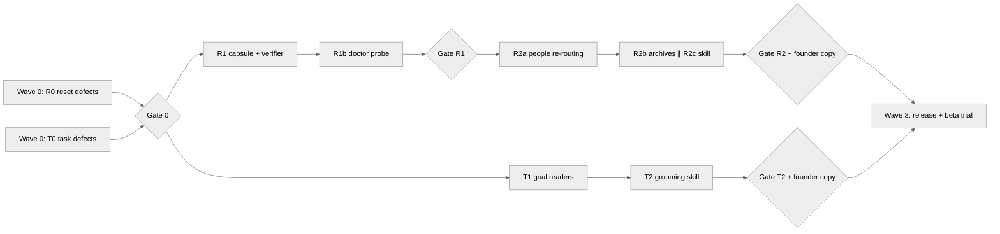

# Orchestration Plan — Change-Job Safety & Task-Goal Backlog

**Status:** Active. Wave 0 is in flight on branch
`claude/dex-feedback-transitions-planning-azfz0k`. Waves 1+ start only after
the previous wave passes its review gate.

**Governing specs (founder-ratified 2026-09-03):**
- `docs/superpowers/specs/2026-09-03-change-job-reset-safety-design.md`
- `docs/superpowers/specs/2026-09-03-task-goal-backlog-design.md`

## Orchestration model

One orchestrating session plans, launches, reviews, and commits. Implementation
subagents build in scoped lanes and never commit. The rules every wave follows:

1. **One agent per lane, lanes own disjoint files.** The file-ownership map
   below is the contract; an agent that needs a file outside its lane stops
   and reports instead of editing it. Where two lanes genuinely need the same
   file (`core/mcp/work_server.py` is the hot spot), the agents run in
   **sequence, never in parallel**.
2. **Agents implement; the orchestrator verifies.** Every agent report is
   treated as a claim, not a fact (repo law: evidence over claims). Before any
   commit the orchestrator: reads the full diff adversarially, re-runs the
   test suites itself (`pytest core/tests`, the `.scripts/lib/tests/*.cjs`
   node tests), runs a code review pass over the diff, and checks the diff
   contains no session/model references and no scope creep beyond the wave.
3. **One commit per lane or per coherent wave**, authored by the orchestrator
   with the diff it verified. Push after each green wave so nothing lives
   only in a container.
4. **Founder gates.** Anything tester-visible comes back to the founder before
   it ships: skill copy and question wording, changelog entries, the
   `/change-job` conversation script, and any decision the specs left open
   that an agent surfaces mid-build. Mechanics inside ratified designs
   auto-proceed.
5. **Failure handling.** An agent that returns red tests or an entangled
   change gets one steer-and-retry with a narrowed scope; after that the lane
   is pulled back into the orchestrator or re-planned, never merged "mostly
   working".

## File-ownership map

| Lane | Owns | Must not touch |
|---|---|---|
| R-lanes (reset stream) | `core/provision.cjs`, `core/mcp/onboarding_server.py`, `core/customization_migration/*`, `.claude/skills/reset/`, new `.claude/skills/change-job/`, `core/utils/doctor.py` (transition probe only), reset-side tests | `core/mcp/work_server.py`, task seeds, planning skills |
| T-lanes (task stream) | `core/mcp/work_server.py`, `01-Quarter_Goals/` + room seed, `03-Tasks/` seed via `tasksContent` only, `.claude/skills/{week-plan,triage}/`, new `.claude/skills/goal-backlog/`, task-side tests, `docs/Dex_System/Dex_Technical_Guide.md` | `core/provision.cjs` outside `tasksContent`, onboarding MCP, reset skill |
| Orchestrator only | `CHANGELOG.md`, `docs/superpowers/{specs,plans}/`, commits/pushes, `CLAUDE.md` if trigger blocks change | — |

`core/mcp/work_server.py` note: T-lane agents that both edit it (Wave 0's
defect agent, Wave T1's readers agent, Wave T2 if it needs tool tweaks) are
strictly serialized.

## Waves

### Wave 0 — defect batches (IN FLIGHT)

Two agents in parallel (disjoint lanes):

- **Agent R0 — reset carry-forward.** Merge-not-replace on `--onboard` when
  `.onboarding-complete` exists; `role_group` into `PROFILE_KEYS`; carry
  forward non-template keys (`calendar`, `working_context`, `work_email`);
  preserve `priority_limits` + pillar `keywords`; room states default from
  the current profile; honest dry-run (per-key old→new) and honest result
  categories; completion marker updated on re-finalize with original
  `completed_at` retained; reset skill documents the re-armed harness and
  calendar gates; reset-over-populated-profile tests (the missing
  counterpart to the update engine's user-content pins).
- **Agent T0 — task defects.** `get_blocked_tasks` reads status `b`;
  `check_goal_alignment` orphan branch implemented; `started` gets a real
  `- [/]` glyph through writer, parser, and every checkbox regex; Tasks.md
  canonicalized to the P0–P3 seed shape (`tasksContent` only) with
  `create_task` defaulting into the priority's section when present; goals
  seed rewritten parseable in both locations plus a lenient fallback parser
  that marks recovered goals `provisional` (never auto-linked, surfaced once
  for confirmation via `week-plan`); `/quarter-plan` promotion out of the
  gated room attempted only if clean, otherwise reported with its full cost;
  Technical Guide's fictional inline-tag task format replaced with the real
  child-bullet format; tests for all of it.

**Review gate 0:** full diff review + both suites green + changelog entry
drafted (CFO test) → one commit per lane, push. Decisions escalated to the
founder: quarter-plan promotion if it proved entangled; any behavior change
the specs didn't settle.

### Wave R1 — the preservation linter

- **Agent R1 — capsule wiring + `verify_transition`.** Before finalize on a
  completed vault: create a customization capsule of `user-profile.yaml`,
  `pillars.yaml`, and room state through `core/customization_migration`
  (these paths are already in its protected inventory — reuse, don't fork).
  New onboarding-MCP tool `verify_transition()`: diff capsule vs. result
  against a transition manifest (the keys the replayed steps were allowed to
  change); any other changed key fails verification, mirroring the existing
  "changed unrelated profile state" invariant. Human-readable report
  ("Changed (you chose): … Carried forward: N settings. Lost: none."), plus
  a capsule-backed restore path for the two config files. Tests: verifier
  passes on a clean carry-forward, fails on an injected unexpected change,
  restore round-trips.
- **Agent R1b — doctor probe** (small, after R1 lands): pending/unverified
  transition capsule probe in `dex-doctor`, reusing the capsule-status
  pattern.

**Review gate R1:** same protocol; additionally the orchestrator injects a
deliberate "lost setting" into a test vault and confirms the linter catches
it — the gate for this wave is a demonstrated catch, not just green tests.

### Wave R2 — `/change-job`

Three agents, sequenced R2a → (R2b ∥ R2c):

- **Agent R2a — people re-routing tool.** New MCP tool
  `reroute_people(old_domains, new_domains, dry_run)`: recompute each
  person's location from recorded `emails:` frontmatter, move
  Internal/External on disk (founder-ratified), rewrite `location:` and the
  `dex_last_written` mirror, rebuild the people index; ambiguous (no-email)
  pages listed, never guessed; dry-run returns the full proposed move list.
  Tests over a fixture vault including Obsidian-mode link survival.
- **Agent R2b — archive passes.** Skill-level flows for archiving old-role
  `Quarter_Goals.md` / `Week_Priorities.md` to
  `07-Archives/Role_Transitions/<date>-<old-role>/` and the per-project
  close/carry/archive walk — propose-confirm-apply, extending the existing
  quarter-plan archive pattern; nothing deleted, ever.
- **Agent R2c — the skill itself.** `.claude/skills/change-job/SKILL.md`:
  capsule → re-onboarding with carry-forward → verify_transition → passes
  (re-route people, archive identity, re-pillar tasks via the T-stream
  grooming flow, housekeeping: marker, identity-snapshot offer, stale
  integrations flagged for review); every pass skippable; final ledger =
  linter report + per-pass record. Natural-language trigger block
  ("I changed jobs", "new role", "went full-time") in CLAUDE.md, `/reset`
  gains its pointer. Skill graded with the repo's skill quality bar.

**Founder gate before merge:** the full conversation script and trigger
wording (tester-visible copy).

### Wave T1 — goal-backlog readers

- **Agent T1 — MCP readers** (serialized after T0 on `work_server.py`):
  `goal`/`project`/`"none"`/`"tentative"` filters on `list_tasks`;
  `get_goal_backlog(goal_id | "all")` grouped goal → pillar-only → orphaned,
  sorted next-up → priority → age, with counts and staleness; task counts
  folded into `calculate_goal_progress` and `get_weekly_planning_context`;
  the `- Next up: N` child bullet parsed and written (founder-ratified for
  v1). Tests for every reader and the ordering round-trip.

### Wave T2 — grooming surface

- **Agent T2 — `/goal-backlog` skill + integrations.** The grooming
  conversation per goal (staleness flags, confirm/clear tentative links,
  retire with approval, set next-up, orphan handling); `/week-plan` step 2
  reads `get_goal_backlog` instead of prose instructions; `/triage` closing
  queue-jump question. Skill graded against the quality bar.

**Founder gate before merge:** grooming-conversation copy.

### Wave 3 — release & beta trial

Orchestrator-owned, no fan-out:

- Changelog entries consolidated (CFO test; the reporter credited as the
  source of both fixes), docs sync check
  (`Dex_System_Guide`, `Folder_Structure`, jobs-to-be-done) for the new
  skills.
- Beta trial per ratified Option A: branch install for the reporter, additive
  changes only, one-command undo for `Next up` bullets documented in the
  trial note; her idea-022/idea-023 long-form write-ups reviewed against the
  shipped behavior for anything missed.
- `/dex-experiment` remains deferred (ratified) — revisit only when an
  experiment must rewrite user content.

## Dependency graph

The R and T streams are independent after Gate 0 and run in parallel;
within each stream, waves are sequential. `work_server.py` writers
(T0 → T1 → T2) never overlap in time.

## Standing risks

1. **`/quarter-plan` promotion entanglement** — room machinery deletes room
   skills on disable and the lens-catalog registry types skills by source;
   T0 reports rather than half-promotes. If entangled, it becomes its own
   small wave after T1.
2. **`work_server.py` size** (6.5k lines) — every T-lane agent gets exact
   function anchors and is told line numbers drift; the orchestrator's diff
   review checks no neighboring behavior changed.
3. **Reset behavior change vs. live vaults** — carry-forward only activates
   when `.onboarding-complete` exists (ratified), and the new parity tests
   pin both paths; the changelog entry must state the new guarantee in plain
   words since this changes what a reset does.
4. **Two agents, one branch** — parallel agents only ever run with disjoint
   file lanes (Wave 0's pairing, R2b∥R2c); everything else is serialized.
