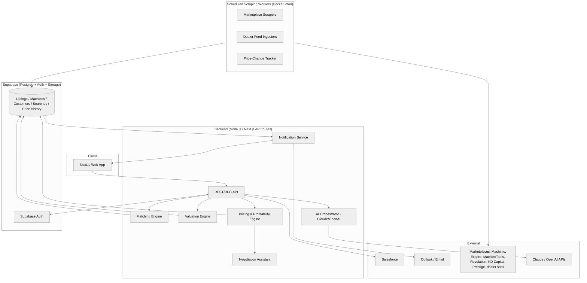
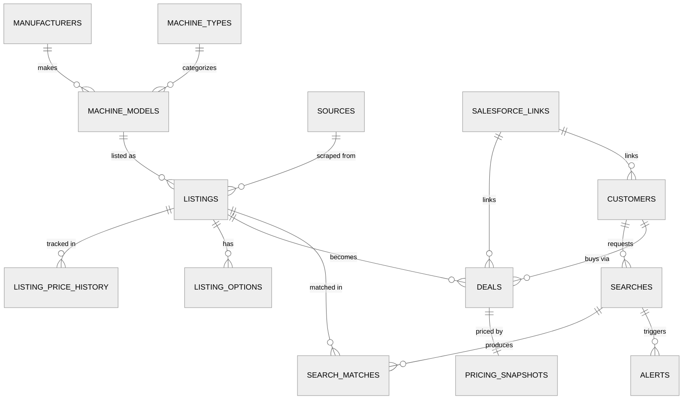
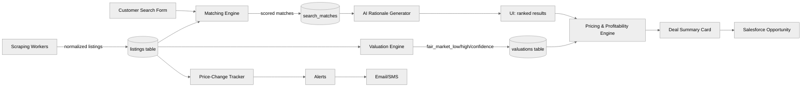

# Used Machinery Intelligence Platform — Architecture

**Status:** Open decisions in §15 confirmed. MVP build started — see [README.md](./README.md) for what's implemented so far (Pricing & Profitability engine, schema, intake form, listing detail + pricing panel).

**Owner:** Chris Barsanti, Mid Atlantic Machinery (sales)
**Scope:** Sheet metal fabrication and structural steel fabrication equipment only.

---

## 1. Executive Summary

A sales-decision tool for machinery brokers/dealers that does three things:

1. **Find** used machines matching a customer's spec (type, brand, size, budget, location) across marketplaces and dealer sites.
2. **Value** each listing against fair market value using comparables, depreciation, and brand/condition adjustments.
3. **Price the deal** — the core module — turning a listing into a quote with margin, markup, competitiveness, and a recommended negotiation range (opening quote / target close / walk-away floor), live while on the phone with a customer.

The Pricing & Profitability Module is the product's center of gravity, not a bolt-on calculator. Search and valuation exist to feed it clean numbers.

---

## 2. Scope Decisions (assumptions made — see §14 for what still needs your sign-off)

| Area | Assumption | Rationale |
|---|---|---|
| Machine types | All categories listed (Lasers, Press Brakes, Plasma Tables, Waterjets, Tube Lasers, Punches, Saws, Welding, Other) supported in schema from day one; MVP UI/matching tuned first for Press Brakes, Plasma, Lasers, and Saws | Your existing deal history (`Projects/`) is heaviest in Baykal/FAB-LINE press brakes, MAM plasma, Cidan lasers, Willis saws/lathes |
| Manufacturers | Full open taxonomy, but matching engine ranks/boosts Mid Atlantic Machinery's represented brands (Cidan, Baykal, EMI, Willis-line brands, etc.) first, with a "customer has a brand preference?" prompt in the intake form | Keeps service/parts alignment; matches your note in the source doc |
| Location | Default sort/filter centers on Eastern PA, radius-configurable | Stated default |
| CRM | Salesforce (confirmed — this Dex vault already has a live Salesforce MCP integration for MAM) | Avoids guessing; Outlook handled via existing Graph/Outlook calendar MCP for email/calendar, not as a second CRM |
| Data acquisition | Hybrid: continuous scraping/ingestion for sources with permissive ToS or public feeds (own dealer inventory feeds, sources that offer RSS/APIs), on-demand federated search for sources that prohibit automated scraping | Continuous scraping of every marketplace regardless of Terms of Service is a legal exposure for a company system — see §6 |

---

## 3. System Architecture



**Key architectural call:** scraping workers run as long-lived Docker containers on a schedule (not serverless functions), because marketplace scraping needs session/browser state, rate-limit backoff, and can run 10+ minutes per source — a poor fit for the Workers/serverless model already used by `extensions/mam-email-triage` (Cloudflare Workers + Durable Objects). This is a deliberate divergence from that extension's stack, not an oversight: this product needs stateful, long-running jobs and a relational schema with heavy joins (comparables, price history), which favors Supabase Postgres over D1/KV.

---

## 4. Database Schema (Supabase / Postgres)



Core tables (columns abbreviated to the fields that matter — full DDL in `schema.sql` once approved):

- **manufacturers** `(id, name, is_mam_represented boolean, reputation_score)`
- **machine_types** `(id, name)` — Laser, Press Brake, Plasma Table, Waterjet, Tube Laser, Punch, Saw, Welding, Other
- **machine_models** `(id, manufacturer_id, machine_type_id, model_name, axis_count, tonnage, bed_length, wattage, typical_options jsonb)`
- **sources** `(id, name, base_url, scrape_method enum['api','scrape','manual_feed'], tos_status enum['permitted','restricted','unknown'], scrape_frequency)`
- **listings** `(id, source_id, machine_model_id, manufacturer_raw_text, model_raw_text, year, wattage, tonnage, bed_length, axis, condition, location, asking_price, listing_url, acquisition_type enum['dealer_inventory','direct_purchase'], first_seen_at, last_seen_at, is_active, raw_payload jsonb)`
- **listing_options** `(id, listing_id, option_name, is_must_have, is_nice_to_have)`
- **listing_price_history** `(id, listing_id, price, observed_at)` — powers "days on market" and price-drop alerts
- **customers** `(id, name, salesforce_account_id, salesforce_contact_id)`
- **searches** `(id, customer_id, machine_type_id, manufacturer_preference, model, min_year, min_wattage, tonnage, bed_length, axis, location, budget_max, must_have_options, nice_to_have_options, notes, is_saved, alert_enabled)`
- **search_matches** `(id, search_id, listing_id, match_score, fit_rating enum['strong','moderate','weak'], ai_rationale text)`
- **alerts** `(id, search_id, listing_id, alert_type enum['new_match','price_drop'], sent_at, channel enum['email','sms'])`
- **valuations** `(id, listing_id, fair_market_low, fair_market_high, fair_market_point, confidence enum['high','medium','low'], method_version, computed_at)`
- **pricing_snapshots** `(id, listing_id, deal_id, dealer_asking_price, dealer_discount_pct, dealer_discount_fixed, net_cost, net_cost_override, quote_price, gross_profit, gross_margin_pct, markup_pct, ideal_quote_price, target_selling_price, walkaway_price, created_at, created_by)` — one row per pricing iteration so history isn't lost as a rep adjusts numbers on a call
- **deals** `(id, listing_id, customer_id, salesforce_opportunity_id, status, freight_estimate, rigging_estimate)`
- **settings_margin_bands** `(id, min_margin_pct, max_margin_pct, label, color)` — the editable Excellent/Very Good/Good/Thin/Low Margin table from §10

---

## 5. Scraping Strategy (per marketplace)

| Source | Method | Notes |
|---|---|---|
| Mid Atlantic Machinery (own inventory) | Direct feed/DB read, no scraping | You control this data — pull from internal inventory export instead of scraping your own site |
| Machinio | Scrape (public listing pages), respect `robots.txt`, throttle to 1 req/3–5s, rotate during off-peak hours | Verify current ToS before enabling continuous crawling; Machinio has previously pursued scrapers legally — recommend starting in "manual refresh" mode until counsel/ToS is confirmed |
| Exapro | Scrape or check for partner API | Similar caution as Machinio |
| MachineTools.com | Scrape | Check ToS |
| Revelation Machinery | Scrape | Dealer site, lower risk, but confirm ToS |
| KD Capital | Scrape | Dealer site |
| Prestige Equipment | Scrape | Dealer site |
| Local dealers | Configurable per-dealer scraper templates (many run on similar dealer CMS platforms — a handful of shared scraper templates should cover most) | Lowest legal risk, easiest to whitelist |

**Compliance rule baked into the architecture:** every `sources` row carries a `tos_status`. The scheduler refuses to run automated crawls against any source flagged `restricted`, falling back to a manual "paste a listing URL, we'll parse just that one page" mode for those. This isn't a hypothetical edge case — it's the default safe behavior until each source is reviewed.

**Common pipeline per source:** fetch → normalize (manufacturer/model/spec extraction via regex + AI fallback for messy titles) → dedupe against existing `listings` by (source, source-listing-id) → diff price vs last seen → write `listing_price_history` row → recompute affected `search_matches`.

---

## 6. API Design (REST, Next.js API routes)

```
POST   /api/searches                  create a saved customer search
GET    /api/searches/:id/matches      ranked matches + fit rating
POST   /api/searches/:id/refresh      force re-match against latest listings

GET    /api/listings/:id              listing detail incl. valuation
GET    /api/listings/:id/price-history

POST   /api/valuations/:listingId/recompute

POST   /api/pricing/:listingId        create/update a pricing snapshot
GET    /api/pricing/:listingId/scenarios?increment=2500   quick pricing scenario table
GET    /api/pricing/:listingId/negotiation                ideal / target / walk-away

POST   /api/deals                     create deal, optionally push to Salesforce
PATCH  /api/deals/:id

POST   /api/ai/summarize-listing
POST   /api/ai/compare-listings
POST   /api/ai/estimate-condition
POST   /api/ai/negotiation-strategy
POST   /api/ai/draft-customer-email

GET    /api/alerts
POST   /api/settings/margin-bands
```

Auth: Supabase Auth (email/password + SSO if MAM has a Google/Microsoft tenant). Every route scoped to the authenticated rep; deals/searches are per-user with a shared "team inventory view" for dealer stock.

---

## 7. UI Wireframes (text)

**Customer Intake Form**
```
[ Machine Type ▾ ] [ Manufacturer(s) - multiselect, MAM brands pinned to top ]
[ Model ]          [ Min Year ] [ Min Wattage ] [ Tonnage ] [ Bed Length ] [ Axis ]
[ Location: Eastern PA ▾, radius ___ mi ]  [ Budget: $______ ]
[ Must-Have Options (tags) ]  [ Nice-to-Have Options (tags) ]
[ Customer Notes (free text) ]
[ Save & Search ]
```

**Results List** — cards with fit badge (Strong/Moderate/Weak), price, source, days-on-market, thumbnail.

**Listing Detail → Pricing Panel** (see §10 for full field-level spec) sits directly on the listing detail page, not a separate screen — the point is to price while looking at the machine.

**Dashboard** — inventory trends, avg price by manufacturer/model/year/region, saved-search alert feed.

---

## 8. Data Flow Diagram



---

## 9. AI Workflow

Claude/OpenAI used for, in order of value:

1. **Listing summarization** — condense noisy scraped/dealer text into a clean spec block.
2. **Overpriced/underpriced flagging** — compare listing price to `valuations` band, flag outliers.
3. **Fit rationale** — why a match is Strong/Moderate/Weak, in plain language, for the `search_matches.ai_rationale` field.
4. **Condition estimation** — from listing text/photos where available (heavier lift, V2+).
5. **Negotiation strategy** — feeds the Negotiation Assistant (§10) with reasoning, not just the three numbers.
6. **Customer email drafting** — quote cover emails, follow-ups.
7. **Comparison** — side-by-side of 2-3 shortlisted machines.
8. **Shipping cost estimate** — rough freight/rigging estimate, informational only (explicitly excluded from margin math per your spec).

All AI outputs are advisory and editable — nothing auto-writes a customer-facing quote without the rep confirming it.

---

## 10. Pricing & Profitability Module — Core Module Spec

This is the product's core module, not a calculator bolted onto search results. Every field below is live — editing any input recalculates the rest instantly (client-side reactive state, server persists on blur/save).

### Machine Value
- Dealer Asking Price
- Fair Market Value (AI Estimated) — point estimate
- Low Estimate / High Estimate
- Confidence Rating (High / Medium / Low)
- Expected Selling Price (editable)

### Acquisition
- Dealer Discount (toggle: % or fixed $)
- Net Cost (auto-calculated)
- Override Net Cost (optional manual override)

```
Net Cost = Dealer Asking Price − Dealer Discount
If Override Net Cost is set, use it instead of the calculated value everywhere downstream.
```

### Sales
- Customer Quote Price (editable)
- Gross Profit ($)
- Gross Margin (%)
- Markup (%)

```
Gross Profit = Quote Price − Net Cost
Gross Margin = Gross Profit ÷ Quote Price
Markup       = Gross Profit ÷ Net Cost
```

### Quick Pricing Scenarios
Auto-generated table around the current Expected/Quote Price, at a user-configurable increment ($1,000 / $2,500 / $5,000 / $10,000 — default $2,500). Algorithm: take Net Cost as fixed, step Quote Price from `(quote_price − 2×increment)` to `(quote_price + 2×increment)` in `increment` steps, compute Profit/Margin/Markup per row using the formulas above. Matches the example table in your spec exactly.

### Pricing Indicators

**Against Dealer Asking Price:** `Selling Above / At / Below Dealer Asking`, with dollar delta shown (e.g. "Selling $7,500 Below Dealer Asking").

**Against Fair Market Value:** `Below Market / At Market / Above Market`, with dollar delta vs. the FMV point estimate (e.g. "$4,200 Below Estimated Market Value").

**Profitability Indicator** — margin bands, editable in Settings (`settings_margin_bands` table), default:

| Margin | Rating | Color |
|---|---|---|
| 20%+ | Excellent | green |
| 15–20% | Very Good | teal |
| 10–15% | Good | yellow |
| 7–10% | Thin | orange |
| <7% | Low Margin | red |

**Competitiveness Indicator** — derived from where Dealer Asking Price sits relative to Fair Market Value band: `Aggressive Price / Competitive / Market Price / Premium Price`.

### Deal Summary Card
Always-visible card, matches your example layout exactly: Dealer Asking Price, Dealer Discount, Net Cost, Fair Market Value range, Customer Quote, Gross Profit, Gross Margin, Markup, plain-language "Selling $X Above Dealer Cost / $Y Below Market Average," and the Deal Rating badge.

### Acquisition Method Flexibility
Two paths into the same engine, converging at Net Cost:
- **Dealer Inventory** — Net Cost = Dealer Asking Price − Dealer Discount (or override).
- **Direct Purchase** — Net Cost entered manually after negotiating with the equipment owner.

Everything downstream (Sales, Indicators, Deal Summary, Negotiation Assistant) is identical regardless of path.

### Negotiation Assistant
Given Net Cost, Fair Market Value band, and the configured margin targets (default 20%, floor 10–12%, overridable), compute:

- **Ideal Quote Price** — priced to land near the top of the FMV band at or above the target (default 20%) margin.
- **Target Selling Price** — the realistic expected close point, typically FMV midpoint adjusted for margin floor.
- **Lowest Acceptable Price** — Net Cost ÷ (1 − minimum acceptable margin), i.e. the price at which margin hits the configured floor; below this the deal needs manual override sign-off.

Rendered as three numbers plus one line of AI-generated reasoning ("why this range"), not just a formula dump — this is what makes it feel like a negotiation tool rather than a spreadsheet.

### Future Enhancements (schema leaves room, not built in MVP)
Days on market, dealer reputation score, condition adjustments, installed/not-installed status, remaining tooling value, freight/rigging estimates (informational, explicitly excluded from margin math), age depreciation curves, historical comparable sales, AI-recommended asking/opening-offer price, probability-of-sale at current quote.

---

## 11. CRM Integration

- **Salesforce**: push/pull Opportunities, Accounts, Contacts. A `deals` row links to `salesforce_opportunity_id`; pricing snapshots sync as Opportunity line notes or a custom field, not a new object type, to avoid a Salesforce schema change up front.
- **Outlook**: not a CRM integration — used for quote emails and calendar context, via the existing Outlook/Graph MCP pattern already in this vault.

## 12. Notifications
Email (and SMS if a provider like Twilio is approved) for: new matching listing, price drop on a saved search or watched listing. Configurable per saved search (`searches.alert_enabled`).

## 13. Tech Stack

- Frontend: React + Next.js (App Router), Tailwind
- Backend: Node.js via Next.js API routes for request/response work; standalone Node services (Dockerized) for scheduled scraping
- DB/Auth: Supabase (Postgres, Auth, Storage for listing photos)
- AI: Anthropic Claude (primary), OpenAI (fallback/secondary), same pattern as `.scripts` already used elsewhere in this vault
- Deployment: Docker Compose for scraping workers + a scheduler (cron or a lightweight queue like BullMQ/Redis); web app on Vercel or containerized alongside
- Auth/session: Supabase Auth

## 14. Development Roadmap (MVP / V2 / Future)

**MVP**
- Customer intake form, manual "paste URL" listing capture (no live scraping yet)
- Manufacturers/models/listings schema, manual/CSV-import listings for MAM's own inventory
- Matching engine (rule-based scoring, no AI yet)
- Pricing & Profitability Module in full (this is the module worth building right first)
- Deal Summary Card, Salesforce push for won deals

**V2**
- Scheduled scraping for the ToS-cleared sources, price history, alerts
- AI valuation engine (comparables + depreciation), AI fit rationale, AI email drafts
- Negotiation Assistant
- Dashboard/trends

**Future**
- Condition estimation from listing photos
- Arbitrage detection between dealers
- Trade-in valuation
- Days-on-market prediction, probability-of-sale modeling

---

## 15. Open Decisions Needing Your Sign-Off

Before MVP work starts, please confirm or adjust:

1. **Scraping legality** — okay to start every marketplace source in "manual paste-URL" mode until each site's ToS is reviewed, rather than crawling immediately? (Recommended: yes.)
2. **Machine type priority for MVP** — build full taxonomy but focus matching/UI polish on Press Brakes, Plasma, Lasers, Saws first (based on your deal history), or a different priority order?
3. **Margin targets** — confirm default 20% target / 15% negotiable / 10–12% floor, overridable, as stated in your spec.
4. **Notification channel** — email only for MVP, or SMS (adds a Twilio dependency/cost) from day one?
5. **Hosting** — Vercel for the web app + a small VPS/Docker host for scrapers, or do you have a preferred infra (e.g. if MAM already pays for AWS/Azure)?

Once these are confirmed, next step is the MVP build starting with schema + the Pricing & Profitability Module, since that's usable value even before search/scraping exist.
